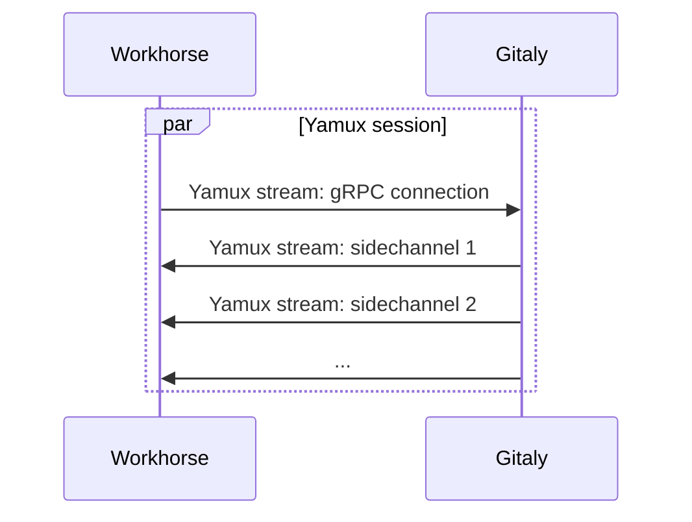

Since GitLab 14.4, Gitaly supports a custom sidechannel protocol for RPCs that transfer a high volume of byte stream data. This protocol significantly improves performance for Git HTTP traffic by bypassing gRPC message overhead.

## Overview

Prior to sidechannel, the only way for Gitaly to serve a byte stream was to encapsulate the bytes in gRPC Protobuf messages. Because of the per-message overhead, this acted as a limiting factor on how much Git fetch traffic a Gitaly server could serve up.

The sidechannel protocol works around this by:

1. Allowing the Gitaly server to establish a sidechannel to the Gitaly client during an RPC call
2. Performing the bulk data transfer on the sidechannel

The surrounding gRPC call is then only used for:

- Parameters such as which repository we're reading data from
- Control information such as the status code and possible error value returned by the server

## Current Usage

Currently, sidechannel is used for:

- **`PostUploadPackWithSidechannel`**: Used for Git HTTP traffic (clone, fetch operations)

More RPCs may adopt the sidechannel protocol in the future for improved performance.

## Architecture

To make this possible without needing extra network ports, Gitaly uses a connection multiplexing library called [Yamux](https://github.com/hashicorp/yamux). Yamux enables establishing multiple virtual network connections (Yamux "streams") within a single real network connection (a Yamux "session").

### Connection Flow

The Gitaly client (typically Workhorse) establishes one persistent Yamux stream to make gRPC calls on. Everytime a sidechannel is needed, the Gitaly server will establish a short-lived Yamux stream in the opposite direction.

## Implementation Details

Sidechannels piggy-back on the existing mechanism of `backchannel` connections that Praefect uses when connecting to one of its backend Gitaly nodes.

### Backchannel Integration

Backchannel uses gRPC-Go "transport credentials" to intercept and replace outgoing (client) and incoming (server) gRPC connections. Backchannel only needs 2 Yamux streams:

- Client->server
- Server->client

However, as a side effect it creates a Yamux session. Sidechannel uses the Yamux session already created by backchannel to establish the short-lived Yamux streams it needs.

## Network Requirements

<Warning>
Because the connection between Workhorse and Gitaly is now a Yamux connection instead of a gRPC connection, you **cannot** route Workhorse->Gitaly traffic through a gRPC proxy.
</Warning>

If you need a proxy between Workhorse and Gitaly, you must use a **TCP proxy** instead. gRPC-aware proxies will not understand the Yamux protocol and will break sidechannel connections.

### Compatible Proxy Types

- **TCP proxies**: HAProxy, nginx stream, AWS NLB ✅
- **gRPC proxies**: Envoy, gRPC-aware load balancers ❌

## Performance Benefits

The sidechannel protocol provides significant performance improvements:

- **Reduced overhead**: Eliminates per-message Protobuf serialization overhead for bulk data
- **Higher throughput**: Enables Gitaly to serve more Git fetch traffic
- **Lower latency**: Direct byte stream transfer without message framing
- **Better resource utilization**: Reduces CPU usage for data serialization/deserialization

## Troubleshooting

### Connection Issues

If you experience connection problems after upgrading to GitLab 14.4 or later:

1. **Check for gRPC proxies**: Ensure you're not routing traffic through a gRPC-aware proxy
2. **Verify Yamux support**: Confirm that any load balancers or proxies support standard TCP connections
3. **Review firewall rules**: Ensure TCP traffic is permitted between Workhorse and Gitaly

### Debugging

To debug sidechannel issues:

- Check Gitaly logs for sidechannel-related errors
- Monitor Prometheus metrics for sidechannel connection failures
- Verify that both Workhorse and Gitaly are on compatible versions (GitLab 14.4+)

## Migration Considerations

When deploying GitLab 14.4 or later:

- **Review network architecture**: Identify any gRPC proxies in the path between Workhorse and Gitaly
- **Update proxy configuration**: Replace gRPC proxies with TCP proxies if necessary
- **Test thoroughly**: Validate Git clone and fetch operations work correctly
- **Monitor performance**: Track improvements in Gitaly throughput and resource usage

## Further Reading

- [GitLab Infrastructure Epic on Sidechannels](https://gitlab.com/groups/gitlab-com/gl-infra/-/epics/463)
- [Yamux Specification](https://github.com/hashicorp/yamux)
- [Gitaly Backchannel Documentation](https://gitlab.com/gitlab-org/gitaly/-/blob/master/doc/README.md)
