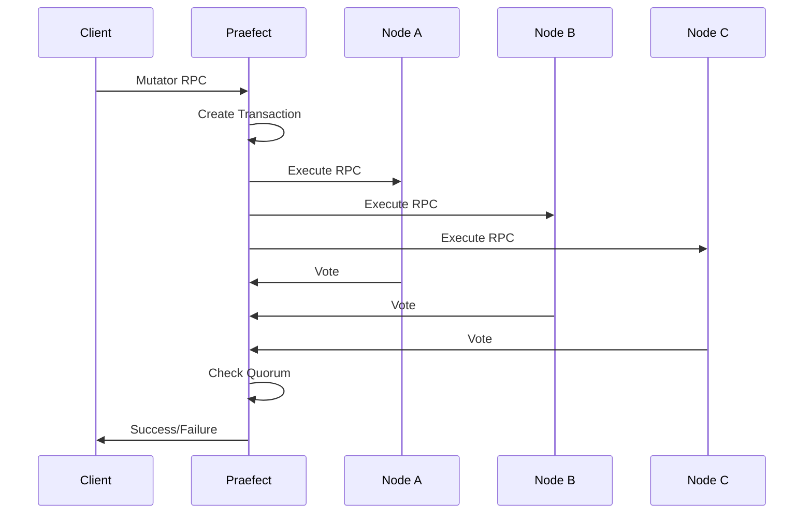
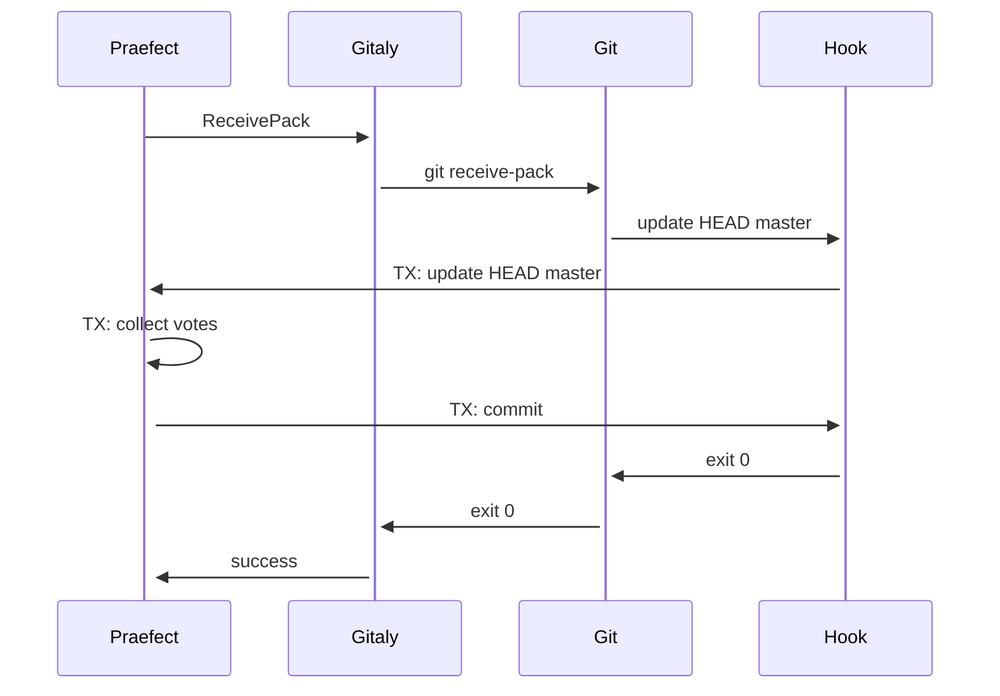

Gitaly classifies every RPC into one of three operation types to enable proper routing, replication, and transaction handling in high-availability deployments.

## Operation Types

Every RPC in Gitaly is annotated with an `op_type` that specifies its operation category:

```protobuf
enum Operation {
  UNKNOWN = 0;
  MUTATOR = 1;
  ACCESSOR = 2;
  MAINTENANCE = 3;
}
```

### ACCESSOR

Accessor RPCs are **read-only** operations that do not modify repository data. They have no side effects and can be safely load-balanced across multiple replica nodes.

**Characteristics:**
- Side-effect free
- Safe to run on any replica
- Can be load-balanced for read distribution
- Do not require transaction coordination
- Do not trigger replication

**Examples from proto files:**

```protobuf
// RepositoryService
rpc RepositoryExists(RepositoryExistsRequest) returns (RepositoryExistsResponse) {
  option (op_type) = {
    op: ACCESSOR
  };
}

rpc RepositorySize(RepositorySizeRequest) returns (RepositorySizeResponse) {
  option (op_type) = {
    op: ACCESSOR
  };
}

rpc GetArchive(GetArchiveRequest) returns (stream GetArchiveResponse) {
  option (op_type) = {
    op: ACCESSOR
  };
}
```

```protobuf
// CommitService
rpc FindCommit(FindCommitRequest) returns (FindCommitResponse) {
  option (op_type) = {
    op: ACCESSOR
  };
}

rpc ListCommits(ListCommitsRequest) returns (stream ListCommitsResponse) {
  option (op_type) = {
    op: ACCESSOR
  };
}

rpc CommitIsAncestor(CommitIsAncestorRequest) returns (CommitIsAncestorResponse) {
  option (op_type) = {
    op: ACCESSOR
  };
}
```

```protobuf
// RefService
rpc FindDefaultBranchName(FindDefaultBranchNameRequest) returns (FindDefaultBranchNameResponse) {
  option (op_type) = {
    op: ACCESSOR
  };
}

rpc FindAllBranches(FindAllBranchesRequest) returns (stream FindAllBranchesResponse) {
  option (op_type) = {
    op: ACCESSOR
  };
}

rpc RefExists(RefExistsRequest) returns (RefExistsResponse) {
  option (op_type) = {
    op: ACCESSOR
  };
}
```

```protobuf
// BlobService
rpc GetBlob(GetBlobRequest) returns (stream GetBlobResponse) {
  option (op_type) = {
    op: ACCESSOR
  };
}

rpc ListBlobs(ListBlobsRequest) returns (stream ListBlobsResponse) {
  option (op_type) = {
    op: ACCESSOR
  };
}
```

### MUTATOR

Mutator RPCs **modify repository data**. These operations change the Git repository state and require special handling in high-availability setups.

**Characteristics:**
- Modifies repository data (refs, objects, config)
- Must be routed to the primary node
- Requires transaction coordination in Praefect
- Triggers replication to secondary nodes
- May invoke Git hooks for authorization

**Examples from proto files:**

```protobuf
// RepositoryService
rpc CreateRepository(CreateRepositoryRequest) returns (CreateRepositoryResponse) {
  option (op_type) = {
    op: MUTATOR
  };
}

rpc WriteRef(WriteRefRequest) returns (WriteRefResponse) {
  option (op_type) = {
    op: MUTATOR
  };
}

rpc FetchRemote(FetchRemoteRequest) returns (FetchRemoteResponse) {
  option (op_type) = {
    op: MUTATOR
  };
}

rpc ApplyGitattributes(ApplyGitattributesRequest) returns (ApplyGitattributesResponse) {
  option (op_type) = {
    op: MUTATOR
  };
}

rpc RemoveRepository(RemoveRepositoryRequest) returns (RemoveRepositoryResponse) {
  option (op_type) = {
    op: MUTATOR
  };
}
```

```protobuf
// RefService
rpc DeleteRefs(DeleteRefsRequest) returns (DeleteRefsResponse) {
  option (op_type) = {
    op: MUTATOR
  };
}
```

```protobuf
// OperationService - all user operations are mutators
rpc UserCreateBranch(UserCreateBranchRequest) returns (UserCreateBranchResponse) {
  option (op_type) = {
    op: MUTATOR
  };
}

rpc UserDeleteBranch(UserDeleteBranchRequest) returns (UserDeleteBranchResponse) {
  option (op_type) = {
    op: MUTATOR
  };
}

rpc UserMergeBranch(stream UserMergeBranchRequest) returns (stream UserMergeBranchResponse) {
  option (op_type) = {
    op: MUTATOR
  };
}

rpc UserCherryPick(UserCherryPickRequest) returns (UserCherryPickResponse) {
  option (op_type) = {
    op: MUTATOR
  };
}

rpc UserCommitFiles(stream UserCommitFilesRequest) returns (UserCommitFilesResponse) {
  option (op_type) = {
    op: MUTATOR
  };
}
```

### MAINTENANCE

Maintenance RPCs perform **housekeeping operations** that optimize repository storage but don't affect the user-visible repository state.

**Characteristics:**
- Optimizes repository structure
- Safe to run asynchronously
- May take significant time/resources
- Does not change user-visible repository state
- Typically scheduled rather than user-initiated

**Examples from proto files:**

```protobuf
// RepositoryService
rpc OptimizeRepository(OptimizeRepositoryRequest) returns (OptimizeRepositoryResponse) {
  option (op_type)  = {
    op: MAINTENANCE
  };
}

rpc PruneUnreachableObjects(PruneUnreachableObjectsRequest) returns (PruneUnreachableObjectsResponse) {
  option (op_type)  = {
    op: MAINTENANCE
  };
}

rpc GarbageCollect(GarbageCollectRequest) returns (GarbageCollectResponse) {
  option (op_type) = {
    op: MAINTENANCE
  };
}

rpc RepackFull(RepackFullRequest) returns (RepackFullResponse) {
  option (op_type) = {
    op: MAINTENANCE
  };
}
```

```protobuf
// RefService
rpc PackRefs(PackRefsRequest) returns (PackRefsResponse) {
  option (op_type) = {
    op: MAINTENANCE
  };
}
```

## Role in High Availability

RPC categories are essential for Gitaly Cluster (Praefect) to provide high availability:

### Accessor RPCs

- Routed to any healthy replica
- Enable read load distribution
- Improve performance and availability
- No replication coordination needed

### Mutator RPCs

Praefect handles mutator RPCs with strong consistency guarantees:

1. **Routing**: Always sent to the primary node
2. **Transaction Creation**: Praefect creates a transaction with all replicas as voters
3. **Execution**: The RPC executes on all replica nodes in parallel
4. **Voting**: Each replica votes on the changes (via reference-transaction hook)
5. **Quorum**: Changes are applied only if quorum is reached (typically all nodes must agree)
6. **Replication**: If any replica fails, replication jobs are scheduled



### Maintenance RPCs

- May be routed to any node
- Do not require transaction coordination
- Typically scheduled independently on each replica
- Can be rate-limited to prevent resource exhaustion

## Transaction Voting

For mutator RPCs, Praefect uses Git's reference-transaction hook to ensure all replicas agree on changes:



Voting ensures:
- All replicas intend to make the same changes
- Changes are applied atomically across all nodes
- Consistency is maintained even with network partitions

## Determining Operation Type

When adding new RPCs, use these guidelines:

| Does the RPC... | Category |
|----------------|----------|
| Only read data, no side effects? | **ACCESSOR** |
| Modify refs, objects, or config? | **MUTATOR** |
| Only optimize storage layout? | **MAINTENANCE** |

**Key question:** If this RPC runs on replica A but not replica B, will they diverge?
- **No divergence** → ACCESSOR or MAINTENANCE
- **Divergence** → MUTATOR

## Proto Annotation

Every RPC must be annotated in the `.proto` file:

```protobuf
service MyService {
  rpc MyRPC(MyRequest) returns (MyResponse) {
    option (op_type) = {
      op: ACCESSOR  // or MUTATOR or MAINTENANCE
    };
  }
}
```

## Related Documentation

- [gRPC API Overview](/api/overview)
- [High Availability Overview](/ha/overview)
- [Praefect Architecture](/ha/praefect)
- [Replication Mechanisms](/ha/replication)