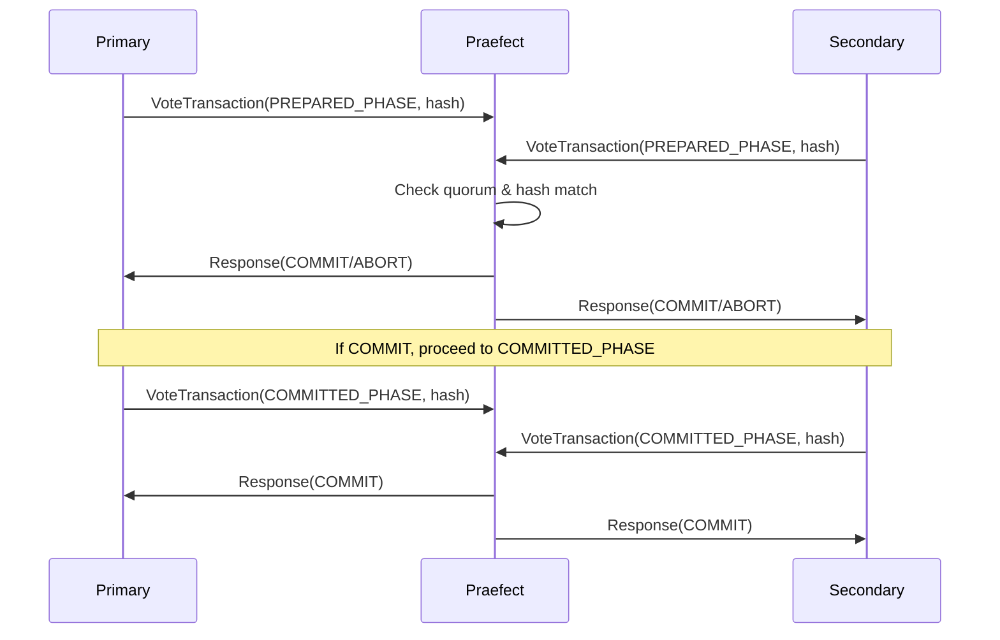

The RefTransaction service provides transaction coordination mechanisms for distributed Gitaly setups. It enables multiple Gitaly nodes to vote on reference updates, ensuring consistency across replicas in high-availability configurations.

## Overview

This service is critical for Praefect's strong consistency model. When a write operation affects Git references, all participating nodes vote on the transaction using this service. The transaction only succeeds if the voting reaches quorum according to the configured strategy.

<Info>
The RefTransaction service works in conjunction with Git's reference-transaction hook to ensure atomic updates across multiple nodes.
</Info>

## VoteTransaction

Cast a vote in a distributed transaction for reference updates.

This RPC is called during the Git reference-transaction hook to coordinate votes between primary and secondary Gitaly nodes. Each node computes a hash of the reference updates and votes with that hash.

<ParamField path="repository" type="Repository" required>
  The repository where the transaction is occurring
</ParamField>

<ParamField path="transaction_id" type="uint64" required>
  Unique identifier of the transaction being voted on
</ParamField>

<ParamField path="node" type="string" required>
  Name of the Gitaly node casting the vote
</ParamField>

<ParamField path="reference_updates_hash" type="bytes" required>
  SHA1 hash of all reference updates being applied in this transaction
</ParamField>

<ParamField path="phase" type="Phase" required>
  The voting phase for this transaction
  
  **Phases:**
  - `UNKNOWN_PHASE` (0) - Unknown phase (deprecated, will become unsupported)
  - `PREPARED_PHASE` (1) - Preparatory phase. Data is locked but not yet written to disk
  - `COMMITTED_PHASE` (2) - Committing phase. Data has been written to disk
</ParamField>

### Response

<ResponseField name="state" type="TransactionState">
  The outcome of the transaction vote
  
  **States:**
  - `COMMIT` (0) - Transaction should be committed
  - `ABORT` (1) - Transaction should be rolled back
  - `STOP` (2) - Transaction voting should stop
</ResponseField>

### Transaction Flow

<Note>
The two-phase voting process (PREPARED and COMMITTED) ensures that all nodes agree on the changes before any node makes them permanent.
</Note>

## StopTransaction

Stop an ongoing transaction, typically used when an error occurs or the transaction is cancelled.

<ParamField path="repository" type="Repository" required>
  The repository where the transaction is occurring
</ParamField>

<ParamField path="transaction_id" type="uint64" required>
  Unique identifier of the transaction to stop
</ParamField>

### Response

Empty response indicating the transaction has been stopped.

## Usage in High Availability

The RefTransaction service is automatically invoked by Git's reference-transaction hook when Praefect is configured for strong consistency. You typically don't call these RPCs directly unless implementing a custom Gitaly client.

### Reference Transaction Hook

Git calls the reference-transaction hook at three points during reference updates:

1. **prepared** - After locks acquired, before writing
2. **committed** - After writing, before unlocking
3. **aborted** - If the transaction fails

The Gitaly reference-transaction hook uses these callbacks to invoke VoteTransaction at the appropriate phases.

### Voting Strategies

The transaction coordinator (Praefect) supports different voting strategies:

- **Strong consistency** - All nodes must vote with matching hashes
- **Majority wins** - Primary + at least half of secondaries must agree
- **Primary wins** - Transaction succeeds if primary votes successfully

See the [Replication Mechanisms](/ha/replication) documentation for more details on voting strategies.

## Related Documentation

- [High Availability Overview](/ha/overview)
- [Replication Mechanisms](/ha/replication)
- [Praefect Configuration](/ha/praefect)
- [RPC Categories](/api/rpc-categories)
