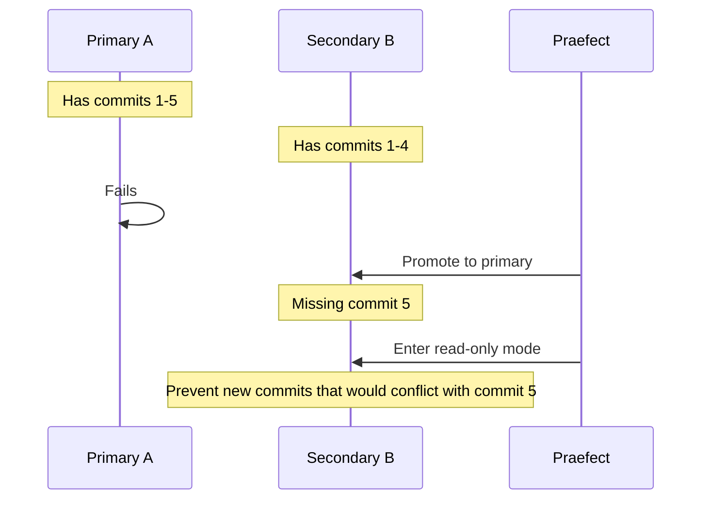

# Failover Procedures

Gitaly Cluster provides automatic failover to maintain availability when primary Gitaly nodes fail. Praefect detects failures, promotes healthy secondaries to primary, and schedules replication to restore redundancy.

## Failover Overview

When a primary Gitaly node becomes unavailable, Praefect automatically:

1. **Detects the failure** through health checks or error tracking
2. **Selects a new primary** from healthy secondary nodes
3. **Promotes the secondary** to serve as the new primary
4. **Updates routing** to direct traffic to the new primary
5. **Schedules replication** to restore data to other secondaries

<Note>
Failover happens per repository (with `per_repository` election strategy) or per virtual storage (with `sql` election strategy).
</Note>

## Failover Strategies

Praefect supports multiple failover strategies:

### Per-Repository Elector (Recommended)

Each repository can have a different primary node, providing optimal availability and load distribution:

```toml
[failover]
enabled = true
election_strategy = "per_repository"
```

**Benefits:**
- Best availability: one node failure doesn't affect repositories on other nodes
- Better load distribution across the cluster
- Granular failover: only affected repositories fail over
- Fastest recovery time

**Requirements:**
- PostgreSQL database for storing primary assignments
- All Praefect nodes must have database access

### SQL Elector

All repositories in a virtual storage share the same primary node:

```toml
[failover]
enabled = true
election_strategy = "sql"
```

SQL elector uses PostgreSQL to coordinate between Praefect nodes:

1. Each Praefect stores its view of node health in the database
2. When a primary fails, Praefects vote on a replacement
3. The candidate with the least replication lag wins
4. A majority of Praefects must agree on the new primary

<Warning>
The `sql` election strategy is deprecated and scheduled for removal in GitLab 14.0. Migrate to `per_repository` following the [migration guide](https://docs.gitlab.com/ee/administration/gitaly/praefect.html#migrate-to-repository-specific-primary-gitaly-nodes).
</Warning>

### Local Elector (Development Only)

Each Praefect makes independent failover decisions without coordination:

```toml
[failover]
enabled = true
election_strategy = "local"
```

**Characteristics:**
- No database required
- No coordination between Praefect instances
- Useful for local development environments
- **Not suitable for production**: different Praefects may disagree on primary

<Warning>
Never use local elector in production. Without coordination, different Praefect instances can route traffic to different primaries, causing split-brain scenarios.
</Warning>

### Failover Disabled

Disable automatic failover for testing or troubleshooting:

```toml
[failover]
enabled = false
```

With failover disabled:
- Virtual storage becomes unavailable if the configured primary fails
- Manual intervention required to restore service
- Useful for debugging or performing controlled maintenance

## Health Monitoring

Praefect continuously monitors Gitaly node health to detect failures.

### Error Tracking

Praefect can promote failover based on error rates:

```toml
[failover]
enabled = true
error_threshold_window = "1m"
read_error_threshold_count = 10
write_error_threshold_count = 5
```

**How it works:**
- Track errors per node within a time window
- Mark a node unhealthy if errors exceed the threshold
- Read errors are weighted separately from write errors
- Unhealthy nodes are excluded from primary election

<Note>
Error thresholds help detect "soft failures" where a node is responding but returning errors. This complements health checks which only detect "hard failures" (node completely down).
</Note>

### Health Checks

With the `per_repository` election strategy, Praefect uses active health checks:

```toml
[failover]
bootstrap_interval = "1s"    # Initial check interval at startup
monitor_interval = "3s"      # Regular check interval during operation
```

Health checks verify:
- Gitaly node is reachable
- gRPC connection is healthy
- Node can respond to basic RPCs

Unhealthy nodes are removed from the candidate pool during election.

## Primary Selection

When electing a new primary, Praefect considers:

### Eligibility Requirements

1. **Health**: Node must be currently healthy
2. **Connectivity**: Node must be reachable by majority of Praefects
3. **Data consistency**: Node must not be significantly behind

### Selection Criteria

Among eligible candidates, Praefect selects based on:

1. **Replication lag**: Prefer nodes with fewer pending replication jobs
2. **Data recency**: Choose the node with the most up-to-date data
3. **Position**: If all else equal, select based on configuration order

<Note>
Praefect prioritizes minimizing data loss over load distribution. The most up-to-date node becomes primary even if it's already serving many repositories.
</Note>

## Read-Only Mode

After failing over to an outdated node, affected repositories enter read-only mode:

### Why Read-Only?

Read-only mode prevents data conflicts:



If the new primary accepted writes immediately, those commits might conflict with unreplicated data from the old primary.

### Recovery from Read-Only

Praefect automatically removes read-only mode when:

1. All missing data is replicated from another node, or
2. Administrator accepts data loss using `accept-dataloss`

**Automatic recovery:**
```bash
# Praefect's reconciler automatically schedules replication
# No manual intervention required if a complete copy exists
```

**Manual recovery:**
```bash
# When complete data is unrecoverable, designate authoritative version
praefect -config /path/to/config.toml accept-dataloss \
  -virtual-storage default \
  -relative-path @hashed/ab/cd/abcd1234.git \
  -authoritative-storage gitaly-2
```

<Warning>
Using `accept-dataloss` permanently discards any data that exists only on failed nodes. Only use this when the failed primary cannot be recovered and you've determined acceptable data loss.
</Warning>

## Identifying Data Loss

After a failover, check for repositories with potential data loss:

```bash
# Check all virtual storages
praefect -config /path/to/config.toml dataloss

# Check specific virtual storage
praefect -config /path/to/config.toml dataloss -virtual-storage default
```

**Example output:**
```
Virtual storage: default
  Repositories:
    @hashed/ab/cd/abcd1234.git:
      Primary: gitaly-2 (1 behind)
      Outdated secondaries:
        gitaly-1: 1 change(s) behind, last healthy at 2021-01-15 10:30:00
```

This indicates:
- Repository's current primary is `gitaly-2`
- `gitaly-1` is missing 1 change from when it was primary
- `gitaly-1` was last seen healthy at the shown timestamp

## Failover Testing

Regularly test failover to verify configuration:

### Planned Failover Test

1. **Verify current state:**
   ```bash
   # Check which node is primary
   praefect -config /path/to/config.toml dataloss
   ```

2. **Stop a Gitaly node:**
   ```bash
   systemctl stop gitaly@gitaly-1
   ```

3. **Monitor Praefect logs:**
   ```bash
   tail -f /var/log/gitlab/praefect/current | grep -i failover
   ```

4. **Verify failover occurred:**
   ```bash
   praefect -config /path/to/config.toml dataloss
   ```

5. **Test repository access:**
   ```bash
   git clone git@gitlab.example.com:group/project.git
   ```

6. **Restart the node:**
   ```bash
   systemctl start gitaly@gitaly-1
   ```

7. **Verify replication:**
   ```bash
   # Check replication queue clears
   curl -s http://praefect:10101/metrics | grep replication_queue_depth
   ```

### Unplanned Failure Simulation

Test handling of abrupt failures:

```bash
# Simulate network partition
iptables -A INPUT -s <gitaly-node-ip> -j DROP
iptables -A OUTPUT -d <gitaly-node-ip> -j DROP

# Wait for failover (monitor logs)
# Then restore connectivity
iptables -D INPUT -s <gitaly-node-ip> -j DROP
iptables -D OUTPUT -d <gitaly-node-ip> -j DROP
```

<Note>
Perform failover tests in a non-production environment first. Even with proper configuration, unexpected edge cases can occur.
</Note>

## Monitoring Failover Events

Track failover through logs and metrics:

### Key Log Messages

```
level=info msg="primary node changed" virtual_storage=default repository=@hashed/... old_primary=gitaly-1 new_primary=gitaly-2
level=warn msg="node marked unhealthy" virtual_storage=default node=gitaly-1 reason="health check failed"
level=info msg="node marked healthy" virtual_storage=default node=gitaly-1
```

### Key Metrics

```prometheus
# Node health status (1=healthy, 0=unhealthy)
gitaly_praefect_node_health{virtual_storage="default",node="gitaly-1"}

# Number of repositories in read-only mode
gitaly_praefect_read_only_repositories{virtual_storage="default"}

# Primary node changes
rate(gitaly_praefect_primary_elections_total[5m])
```

## Best Practices

1. **Use per-repository election**: Provides best availability and granularity
2. **Configure error thresholds**: Catch soft failures before they impact users
3. **Monitor replication lag**: Large lag increases data loss risk during failover
4. **Test regularly**: Verify failover works before you need it
5. **Plan for data loss**: Document procedures for handling `accept-dataloss` scenarios
6. **Size appropriately**: Ensure remaining nodes can handle load after failover

## Recovering Failed Nodes

When a failed node comes back online:

1. **Praefect detects recovery** through health checks
2. **Node marked healthy** and eligible for primary election
3. **Replication scheduled** to bring node up-to-date
4. **Node rejoins cluster** once replication completes

No manual intervention is typically required. Monitor replication queue to verify recovery progresses:

```bash
curl -s http://praefect:10101/metrics | grep 'replication_queue.*gitaly-1'
```

## Next Steps

<CardGroup cols={2}>
  <Card title="HA Overview" icon="layer-group" href="/ha/overview">
    Review high availability concepts
  </Card>
  <Card title="Praefect Configuration" icon="gear" href="/ha/praefect">
    Configure failover settings
  </Card>
</CardGroup>