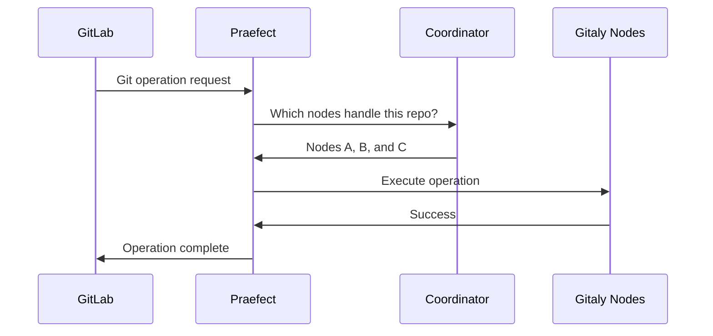

# Praefect Configuration

Praefect is a reverse-proxy server that provides high availability for Gitaly. It routes RPC traffic to Gitaly nodes, coordinates transactions, and manages replication across your cluster.

## Architecture Overview

Praefect sits between GitLab and your Gitaly nodes:



## Basic Configuration

Create a configuration file for Praefect (e.g., `/etc/gitlab/praefect/config.toml`):

```toml
# TCP address to listen on
listen_addr = "127.0.0.1:2305"

# Optional: TLS configuration
# tls_listen_addr = "127.0.0.1:2306"
# [tls]
# certificate_path = '/path/to/cert.cert'
# key_path = '/path/to/key.pem'

# Socket path for local connections
# socket_path = "/var/opt/gitlab/gitaly/praefect.socket"

# Grace period before forcibly terminating
graceful_stop_timeout = "30s"

# Prometheus metrics endpoint
prometheus_listen_addr = "127.0.0.1:10101"

# Logging configuration
[logging]
format = "json"
level = "info"  # debug, info, warn, error, fatal, panic

# Optional: Sentry error tracking
# [sentry]
# sentry_environment = "production"
# sentry_dsn = "https://your-sentry-dsn"

# Authentication token (shared with Gitaly nodes)
[auth]
token = 'your-secret-token-here'
```

<Warning>
Keep your authentication token secure. This token must match the token configured on your Gitaly nodes.
</Warning>

## Virtual Storage Configuration

Virtual storage defines logical storage shards composed of multiple Gitaly nodes:

```toml
[[virtual_storage]]
name = 'default'

# Primary node
[[virtual_storage.node]]
  storage = "gitaly-1"
  address = "tcp://gitaly-1.internal:8075"
  token = 'gitaly-token-1'

# Secondary nodes
[[virtual_storage.node]]
  storage = "gitaly-2"
  address = "tcp://gitaly-2.internal:8075"
  token = 'gitaly-token-2'

[[virtual_storage.node]]
  storage = "gitaly-3"
  address = "tcp://gitaly-3.internal:8075"
  token = 'gitaly-token-3'
```

<Note>
For optimal high availability, configure at least 3 Gitaly nodes per virtual storage. This allows the cluster to tolerate one node failure while maintaining quorum.
</Note>

## Database Configuration

Praefect requires PostgreSQL to store its internal state:

```toml
[database]
host = "postgres.internal"
port = 5432
dbname = "praefect_production"
sslmode = "require"

# Authentication options
user = "praefect"
password = "your-secure-password"

# Or use session pooler
# session_pooled.host = "pgbouncer.internal"
# session_pooled.port = 5432
```

### Database Setup

Before starting Praefect, initialize the database:

```bash
# Check database connectivity
praefect -config /path/to/config.toml sql-ping

# Apply database migrations
praefect -config /path/to/config.toml sql-migrate

# Check migration status
praefect -config /path/to/config.toml sql-migrate-status
```

## Replication Configuration

Control how Praefect handles replication jobs:

```toml
[replication]
# Number of replication jobs to process simultaneously
batch_size = 10

# Number of parallel workers per storage
parallel_storage_processing_workers = 2
```

## Reconciliation Configuration

Automatic reconciliation repairs outdated replicas:

```toml
[reconciliation]
# Run reconciler every 5 minutes (0 disables)
scheduling_interval = "5m"

# Histogram buckets for metrics
histogram_buckets = [0.005, 0.01, 0.025, 0.05, 0.1, 0.25, 0.5, 1, 2.5, 5, 10]
```

<Note>
Automatic reconciliation scans for inconsistencies and schedules replication jobs to repair them. This is only available with the PostgreSQL queue (not in-memory mode).
</Note>

## Failover Configuration

Enable automatic failover to promote secondary nodes when the primary fails:

```toml
[failover]
enabled = true
election_strategy = "per_repository"

# Error thresholds for marking nodes unhealthy
read_error_threshold_count = 10
write_error_threshold_count = 5
error_threshold_window = "1m"
```

### Election Strategies

**per_repository** (recommended): Each repository can have a different primary node. Provides the best availability and load distribution.

**sql**: Uses SQL-based election with majority consensus. All repositories in a virtual storage share the same primary.

**local**: For development only. No coordination between Praefect instances.

<Warning>
The `sql` and `local` election strategies are deprecated and scheduled for removal. Migrate to `per_repository` following the [migration guide](https://docs.gitlab.com/ee/administration/gitaly/praefect.html#migrate-to-repository-specific-primary-gitaly-nodes).
</Warning>

## Repository Cleanup

Automatic cleanup removes orphaned repositories:

```toml
[repositories_cleanup]
run_interval = "24h"
check_interval = "30m"
repositories_in_batch = 10
```

## Background Verification

Verify replica consistency in the background:

```toml
[background_verification]
verification_interval = "168h"  # 1 week
delete_invalid_records = false
```

## Command-Line Tools

Praefect includes several subcommands for administration:

### Check Node Connectivity

```bash
praefect -config /path/to/config.toml dial-nodes
```

### Identify Data Loss

Find repositories with missing data after failover:

```bash
# Check all virtual storages
praefect -config /path/to/config.toml dataloss

# Check specific virtual storage
praefect -config /path/to/config.toml dataloss -virtual-storage default
```

### Accept Data Loss

When recovery is impossible, manually designate an authoritative version:

```bash
praefect -config /path/to/config.toml accept-dataloss \
  -virtual-storage default \
  -relative-path @hashed/ab/cd/abcd1234.git \
  -authoritative-storage gitaly-2
```

<Warning>
Using `accept-dataloss` permanently discards any data that exists only on other nodes. Only use this when the authoritative copy cannot be recovered.
</Warning>

## Monitoring

Praefect exposes Prometheus metrics for monitoring:

```toml
prometheus_listen_addr = "0.0.0.0:10101"

# Separate endpoint for database metrics
[prometheus]
scrape_timeout = "5s"
exclude_database_from_default_metrics = false
```

### Key Metrics

- `gitaly_praefect_transactions_total`: Number of transactions created
- `gitaly_praefect_transactions_delay_seconds`: Delay waiting for quorum
- `gitaly_praefect_replication_delay_seconds`: Replication lag time
- `gitaly_praefect_replication_queue_depth`: Pending replication jobs
- `gitaly_praefect_node_connections`: Node connection status

## Starting Praefect

Once configured, start the Praefect service:

```bash
praefect -config /path/to/config.toml
```

<Note>
Praefect logs version information on startup. Verify the version with `praefect -version`.
</Note>

## Next Steps

<CardGroup cols={2}>
  <Card title="Replication" icon="arrows-rotate" href="/ha/replication">
    Learn how replication works in detail
  </Card>
  <Card title="Failover" icon="shield" href="/ha/failover">
    Configure and test failover procedures
  </Card>
</CardGroup>