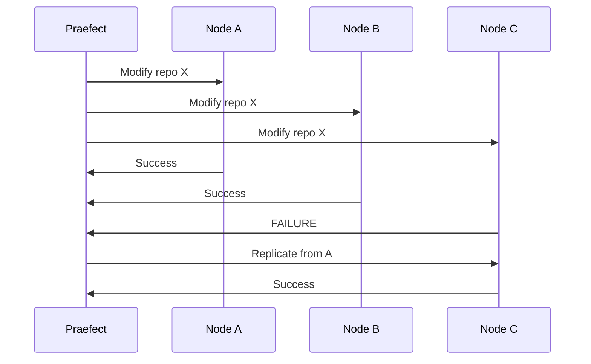
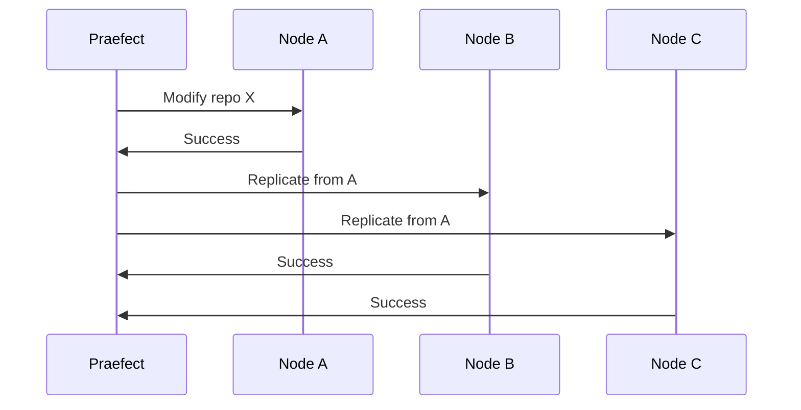
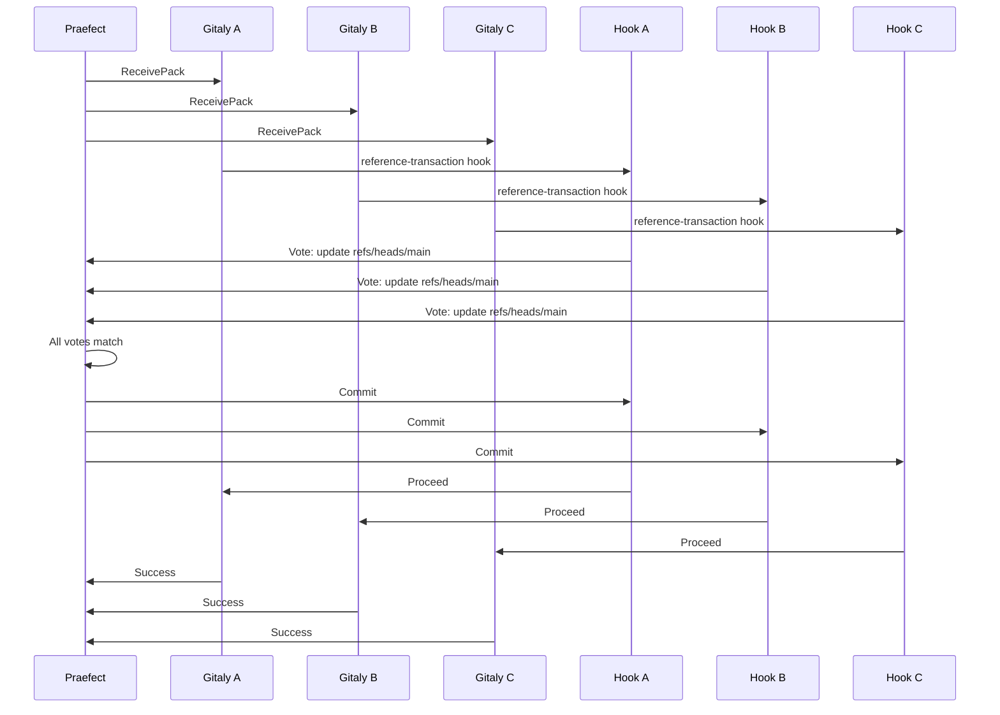

# Replication Mechanisms

Gitaly Cluster uses replication to keep repository data synchronized across multiple Gitaly nodes. This ensures data redundancy and enables failover when nodes become unavailable.

## When Replication Occurs

Praefect relies on replication in two scenarios:

1. **After non-transactional operations**: When a Gitaly RPC doesn't support transactions, changes are applied to the primary and then replicated to secondaries.

2. **For replica repair**: When a transaction fails on some nodes but succeeds on a quorum, the unsuccessful replicas are repaired via replication.

## Transactional Replication

For transaction-aware mutator RPCs, Praefect attempts to apply changes to all replicas simultaneously:



If a quorum of replicas successfully applies the RPC, replication is scheduled only for unsuccessful replicas. This minimizes replication overhead while maintaining consistency.

<Note>
Transactional replication uses Git's reference-transaction hook to coordinate writes across nodes. See [Strong Consistency](#strong-consistency-via-reference-transactions) for details.
</Note>

## Non-Transactional Replication

For mutator RPCs that don't support transactions, Praefect routes the request to the primary only:



Once the primary completes the operation, Praefect schedules replication jobs to update all secondary nodes.

## Replication Process

The replication process varies depending on whether the target repository already exists:

### New Repository Creation

When replicating to a node that doesn't have the repository:

1. **Snapshot**: Create a compressed archive of the source repository
2. **Transfer**: Send the snapshot to the target Gitaly node
3. **Extract**: Decompress and extract the repository on target
4. **Fetch**: Perform a Git fetch to get any changes that occurred during transfer
5. **Sync files**: Copy additional files (e.g., `info/attributes`)

### Existing Repository Update

When the target repository already exists:

1. **Fetch**: Perform a Git fetch from the source repository
2. **Update references**: Apply reference changes from source
3. **Sync files**: Update auxiliary files if changed

### Object Pool Handling

If the source repository uses an object pool:

1. Get object pool information from source
2. Replicate or link to the object pool on target
3. Link the target repository to the appropriate object pool

<Note>
Object pools allow multiple repositories to share common objects, reducing storage requirements. Praefect ensures object pool membership is maintained across replicas.
</Note>

## Replication Job Queue

Praefect uses a PostgreSQL-backed queue to manage replication jobs:

```toml
[replication]
batch_size = 10  # Jobs to process simultaneously
parallel_storage_processing_workers = 2  # Workers per storage
```

### Job Lifecycle

1. **Scheduled**: Praefect creates a job when a repository is modified
2. **Dequeued**: A replication worker picks up the job
3. **In Progress**: The worker replicates data from source to target
4. **Completed**: Job is removed from the queue on success
5. **Failed**: Job is retried with exponential backoff on failure

### Monitoring the Queue

Check queue depth with the `gitaly_praefect_replication_queue_depth` metric:

```bash
curl -s http://praefect:10101/metrics | grep replication_queue_depth
```

A growing queue indicates replication can't keep up with changes.

## Strong Consistency via Reference Transactions

Gitaly Cluster achieves strong consistency by coordinating reference updates across nodes using Git's reference-transaction hook.

### Transaction Flow



### How It Works

1. **RPC Broadcast**: Praefect sends the mutator RPC to all replica nodes simultaneously
2. **Git Execution**: Each Gitaly node executes the Git command
3. **Hook Trigger**: Git calls the reference-transaction hook before updating references
4. **Vote Submission**: Each hook sends a hash of the proposed changes to Praefect
5. **Quorum Check**: Praefect waits for all votes and verifies they match
6. **Commit/Abort**: If quorum is reached, Praefect tells hooks to commit; otherwise abort
7. **Result**: Git updates references only if the hook succeeded

<Note>
The reference-transaction hook requires Git 2.28.0 or newer. Older Git versions fall back to eventual consistency.
</Note>

### Voting Strategies

Praefect supports multiple voting strategies:

**Strong** (default): All nodes must agree. Threshold equals the number of voters.
```
Voters: 3 nodes, 1 vote each
Threshold: 3 votes
Result: All nodes must vote identically
```

**Majority**: More than half of nodes must agree. Threshold is `ceil((votes+1)/2)`.
```
Voters: 3 nodes, 1 vote each
Threshold: 2 votes
Result: Primary + at least 1 secondary must agree
```

**Primary Wins**: Primary always succeeds. Secondaries get 0 votes.
```
Voters: Primary=1 vote, Secondaries=0 votes
Threshold: 1 vote
Result: Equivalent to eventual consistency with faster failure detection
```

<Warning>
The "Strong" voting strategy provides the highest consistency but requires all nodes to be healthy. Consider "Majority" for better availability in environments with frequent node issues.
</Warning>

## Transaction Metrics

Monitor transaction performance with these metrics:

- `gitaly_praefect_transactions_total`: Total transactions created
- `gitaly_praefect_transactions_delay_seconds`: Time waiting for quorum
- `gitaly_praefect_subtransactions_per_transaction_total`: Subtransactions per transaction
- `gitaly_praefect_voters_per_transaction_total`: Nodes voting per transaction

## Automatic Reconciliation

Praefect can automatically detect and repair inconsistencies:

```toml
[reconciliation]
scheduling_interval = "5m"
histogram_buckets = [0.005, 0.01, 0.025, 0.05, 0.1, 0.25, 0.5, 1, 2.5, 5, 10]
```

The reconciler:

1. Scans repositories for inconsistencies
2. Compares replicas to identify outdated copies
3. Schedules replication jobs to repair outdated replicas
4. Reports metrics on reconciliation progress

<Note>
Reconciliation runs periodically and is independent of normal replication. It acts as a safety net to catch and fix any consistency issues.
</Note>

## Replication Performance Considerations

### Large Repositories

Replication can be resource-intensive for large repositories:

**Snapshot overhead**: Creating compressed archives consumes CPU and I/O. For very large repositories, this can take significant time.

**Network transfer**: Large snapshots must be transferred over the network. Ensure sufficient bandwidth between Gitaly nodes.

**Storage pressure**: During snapshot extraction, you temporarily need space for both the compressed and uncompressed data.

### Fork Networks

Forked repositories can be particularly challenging:

- Without object pools, each fork creates a full copy during replication
- Storage quotas may be exceeded temporarily until housekeeping runs
- Read distribution can show inconsistent disk usage depending on which replica is queried

<Warning>
Monitor storage usage carefully when replicating repositories with large fork networks. Consider using object pools to reduce duplication.
</Warning>

## Replication Best Practices

1. **Monitor queue depth**: A growing replication queue indicates capacity issues
2. **Size batch appropriately**: Balance throughput and resource usage with `batch_size`
3. **Enable reconciliation**: Catch and repair any missed replication jobs
4. **Use object pools**: Reduce storage and replication overhead for fork networks
5. **Watch metrics**: Track replication delay and latency to detect problems early

## Next Steps

<CardGroup cols={2}>
  <Card title="Failover" icon="shield" href="/ha/failover">
    Learn how failover works when nodes fail
  </Card>
  <Card title="Praefect Configuration" icon="gear" href="/ha/praefect">
    Configure replication settings
  </Card>
</CardGroup>